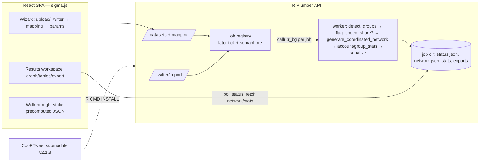

# CooRTweet Web (coornet-web) — Coordinated Behavior Detection Tool

## Context

Repo `coornet-web` currently contains only a README and the two methodology papers (Giglietto et al. 2020/2023). Goal: a public, cloud-hosted web app exposing the CooRTweet R package (v2.1.3) pipeline — `prep_data` → `detect_groups` → `generate_coordinated_network` → `account_stats`/`group_stats` — with an R Plumber REST API (real package, no reimplementation), a React frontend with interactive network viz, CSV upload + Twitter/X API v2 connector (bring-your-own-key), and a guided walkthrough reproducing the papers' analyses. All architecture decisions below were made with the user; this plan grounds them in the verified package source.

**Repo reality check (found during planning):** `CooRTweet/` was gitignored and absent from the repo. **Resolved by the user:** they forked `nicolarighetti/CooRTweet` (MIT; v2.1.3), removed the `.gitignore` entry, and added the fork as a git submodule at `CooRTweet/`. Implementation consumes the submodule as-is; the fork enables later patches (e.g., progress hooks) without vendoring.

## Verified package facts (from source, drive the design)

- `detect_groups(x, time_window=10, min_participation=2, remove_loops=TRUE)` → data.table `object_id, account_id, account_id_y, content_id, content_id_y, time_delta` (`CooRTweet/R/detect_groups.R:53`). Pre-filters accounts with `< min_participation` rows, then per-object pairwise combinations.
- `generate_coordinated_network(x, fast_net=FALSE, edge_weight=0.5, subgraph=0, objects=FALSE)` (`generate_coordinated_network.R:95`): aggregates pairs → undirected igraph with edge attrs `weight, avg_time_delta, n_content_id, n_content_id_y, edge_symmetry_score` (+ `object_ids` when `objects=TRUE`). Threshold semantics: `threshold <- stats::quantile(weights, edge_weight)` (default type-7) and flag `weight_threshold = weight > threshold` (**strict >**). With `fast_net=TRUE` (after `flag_speed_share`) attrs are suffixed `_full`/`_fast` and two flags `weight_threshold_full`/`weight_threshold_fast` exist. `subgraph`: 1 = edges above threshold; 2 = fast edges above fast threshold; 3 = fast-coordinated vertices + neighbors, adds `color_v`.
- `account_stats(coord_graph, result, weight_threshold=c("full","fast","none"))` — **requires the detect_groups result as 2nd arg** (worker must keep it). `group_stats(coord_graph, weight_threshold)` requires the graph built with `objects=TRUE`.
- `flag_speed_share(x, result, min_participation, time_window)` adds a `time_window_{N}` 0/1 column to the detect result (`flag_speed_share.R:25`).
- `prep_data(x, object_id, account_id, content_id, timestamp_share)` renames columns; coerces non-numeric timestamps via `as.POSIXct(tz="UTC")`, errors if NA (`prep_data.R:48`).
- `reshape_tweets` intents (`reshape_tweets.r`): retweets / hashtags / urls / urls_domains / cotweet. **Retweets nuance:** original tweets present in the collection are appended as shares of their own `object_id` (`referenced_tweet_id := tweet_id`) — the connector must mirror this.
- Bundled data: `russian_coord_tweets` (35,125 rows, already 4-col schema), `german_elections` (218,971 rows; account_id/post_id/url_id/hashtag_id/domain_id/image_id/timestamp).
- Vignette params (walkthrough + golden-test source of truth, `vignettes/vignette.Rmd` + `reproduce_examples.Rmd`): russian → `detect_groups(time_window=60, min_participation=2)`, `generate_coordinated_network(edge_weight=0.5, subgraph=1)`; german multi-intent → `prep_data` per intent (urls/domains/hashtags/images), `detect_groups(time_window=30, min_participation=2)` each, combined `rbindlist` → one network; FB-urls fast example → `detect_groups(60,2)` + `flag_speed_share(time_window=10, min_participation=2)` + `generate_coordinated_network(fast_net=TRUE)`.
- Package Imports: data.table, tidytable, RcppSimdJson, lubridate, igraph, stringi.

## Validated during environment probe (remote session facts)

A short build probe was run during planning (then fully reverted at the user's request). These findings are verified, not assumptions:

- **Repo/remote**: the remote sandbox clone has **no `origin` remote configured** — implementation must first `git remote add origin https://github.com/akinfemi/coornet-web.git` (verified reachable through the session's git proxy; latest main `f3c001e` carries the submodule). Submodule = fork `akinfemi/CooRTweet` @ `de337e0`, DESCRIPTION Version 2.1.3 — initializes and installs cleanly.
- **R toolchain**: Ubuntu noble apt provides R 4.3.3 and binary `r-cran-*` for nearly every dependency (plumber 1.2.1, httr2 1.0.0, igraph 1.6.0, callr, later, ps, uuid, readr, lubridate, stringi, testthat, httpuv, promises; also add `r-cran-r.utils` for `fread()` on .gz and `r-cran-mime`, `r-cran-xfun`, `r-cran-digest`).
- **CRAN is egress-blocked here** (cloud.r-project.org, cran.r-project.org, packagemanager.posit.co, r2u all 403) but **GitHub cloning works** → install the four packages missing from apt by cloning + `R CMD INSTALL`: `tidytable`, `RcppSimdJson`, `rgexf`, `httptest2`. Two version pins bite: rgexf needs `servr`, whose HEAD needs `xfun >= 0.58` (apt has 0.41 → install `yihui/xfun` from source first), and tidytable HEAD needs `data.table >= 1.16` (apt has 1.14.10 → install `Rdatatable/data.table` from source first). `R CMD INSTALL a b c` aborts everything after the first failure — install packages individually. Full chain verified: CooRTweet 2.1.3 loads, `nrow(russian_coord_tweets)` = 35125, fixture CSVs export (russian 3.7 MB, german 7.2 MB).
- **Plumber specifics** (verified against a live server): the default JSON serializer boxes scalars — set `pr_set_serializer(pr, serializer_unboxed_json())`; multipart uploads need `parsers = c("multi", "octet")` on the upload endpoint, and each part arrives as a list with `$value` (raw bytes) + `$filename` — `mime::parse_multipart(req)` does NOT work under plumber 1.2.1.
- **No Docker daemon** in the remote env (CLI present, daemon unavailable) — verify the API via `Rscript api/entrypoint.R` directly; Docker builds must be validated on the user's machine or CI. Node 22.22 + npm are present; Playwright Chromium is preinstalled at `/opt/pw-browsers`.

## Architecture



## Repo layout (repo root = project root)

```
coornet-web/
├── CooRTweet/                  # git submodule → nicolarighetti/CooRTweet @ v2.1.3 commit
├── papers/                     # existing
├── api/
│   ├── plumber.R               # mounts routers, filters
│   ├── entrypoint.R            # pr_run(host="0.0.0.0", port=8000)
│   ├── R/
│   │   ├── routes_datasets.R   # upload, preview, mapping/validation
│   │   ├── routes_jobs.R       # create/status/results/exports
│   │   ├── routes_twitter.R    # X API import
│   │   ├── routes_walkthrough.R
│   │   ├── jobs.R              # registry, callr launcher, semaphore, later tick
│   │   ├── job_worker.R        # child-process pipeline
│   │   ├── serialize.R         # igraph → JSON, GraphML/GEXF writers
│   │   ├── validate.R          # schema validation, size limits
│   │   ├── sources/{source.R, source_upload.R, source_twitter.R}
│   │   ├── storage.R           # dirs, TTL sweeper
│   │   └── filters.R           # CORS, rate limit, body size, errors
│   ├── scripts/{build_walkthrough.R, export_fixtures.R}
│   └── tests/testthat/
├── web/                        # Vite + React + TS
├── docker/{api.Dockerfile, web.Dockerfile, Caddyfile, docker-compose.yml}
└── fly.api.toml / fly.web.toml
```

**Submodule (already set up by user):** `CooRTweet/` is a submodule of the user's fork, pinned at v2.1.3. Implementation starts with `git pull` + `git submodule update --init` and verifies `CooRTweet/DESCRIPTION` reads Version 2.1.3. Docker builds `R CMD INSTALL /src/CooRTweet` from the submodule checkout; CI/remote must clone with `--recurse-submodules`; the api.Dockerfile fails loudly if `CooRTweet/DESCRIPTION` is missing.

## Backend (R Plumber)

R deps: `plumber`, `callr`, `jsonlite`, `data.table`, `uuid`, `httr2`, `later`, `readr`, `rgexf`, `ps` + CooRTweet's Imports (above), installed from CRAN; CooRTweet from the submodule.

### Endpoints (`/api/v1`)
- `POST /datasets` — multipart CSV (+gzip) upload → `{dataset_id, columns, n_rows, sample_rows}`
- `POST /datasets/{id}/mapping` — `{object_id, account_id, content_id, timestamp_share}` column names → runs `CooRTweet::prep_data()` + validation (catch its timestamp error and surface per-row diagnostics), persists mapped 4-col dataset (arrow/fst or RDS), returns validation report
- `POST /jobs` — `{dataset_id, params: {time_window, min_participation, remove_loops, edge_weight, subgraph, objects, fast_net?: {time_window}}}` → `{job_id, status:"queued"}`
- `GET /jobs/{id}` — status + stage (`detecting`, `flagging_speed`, `building_network`, `stats`, `serializing`)
- `GET /jobs/{id}/network` — streams `network.json`
- `GET /jobs/{id}/accounts`, `/groups` — paginated stats tables
- `GET /jobs/{id}/export?format=graphml|gexf|accounts_csv|groups_csv|pairs_csv`
- `POST /twitter/import` — `{bearer_token, mode: search_recent|search_all|user_tweets, query|user_id, intent: retweets|hashtags|urls|urls_domains, max_results, start_time?, end_time?}` → import job → yields `dataset_id`
- `GET /sources` — source registry metadata (drives the wizard's source picker; Bluesky/Telegram land here in v2)
- `GET /walkthrough` (list seeds), `POST /walkthrough/{slug}/open` (seed a real dataset from bundled data), `GET /healthz`
- Admin (require `ADMIN_TOKEN` bearer): `DELETE /jobs/{id}`, `POST /admin/sweep`

### Job queue — `callr::r_bg`
Fresh R subprocess per job (crash/OOM isolation, memory returned on exit, `ps::ps_kill()` on timeout). In-memory registry + `status.json` in the job dir (survives restart; on boot, rescan job dirs). Semaphore caps `MAX_CONCURRENT_JOBS` (default 2); a `later::later` 2s tick launches queued jobs, enforces `JOB_TIMEOUT_S` (900), runs the TTL sweeper.

Worker pipeline: mapped dataset → `detect_groups()` → optional `flag_speed_share()` → `generate_coordinated_network()` → `account_stats(graph, detect_result, weight_threshold)` (+ `group_stats()` when `objects=TRUE`) → write artifacts + stage updates to `status.json`.

**Re-run optimization:** cache the detect result as `detect_{time_window}_{min_participation}_{remove_loops}.rds` under the dataset dir — edge-weight-only changes skip the pairwise step. The **edge-weight percentile slider is client-side**: server ships a 101-point `weight_quantiles` grid (p = 0, 0.01, …, 1) computed with `stats::quantile(type=7)` and the client replicates the exact semantics `weight > quantile[p]` (strict >) as a sigma edgeReducer filter. Server re-runs only for `time_window` / `min_participation` / `subgraph` / `fast_net` changes.

### igraph → JSON (`serialize.R`)
`igraph::as_data_frame(g, what="both")` + `jsonlite::toJSON`. Payload: `meta` (counts, params, `weight_quantiles`, fast-net flag), `nodes` (id, degree, strength, Louvain `community` via `igraph::cluster_louvain`, joined `account_stats` cols), `edges` (source, target, weight, avg_time_delta, edge_symmetry_score, weight_threshold flag[s]; `*_full`/`*_fast` variants when fast_net). GraphML via `igraph::write_graph`; GEXF via `rgexf`.

### Storage, validation, security
- `DATA_DIR=/data` volume: `/data/datasets/{uuid}/…`, `/data/jobs/{uuid}/…`. TTL sweeper deletes after `RETENTION_HOURS` (72), advertised in UI. UUIDv4 unguessable URLs = v1 access model.
- Limits: `MAX_UPLOAD_MB` (100) in a plumber filter AND Caddy `request_body max_size`; `MAX_ROWS` (2M); `MAX_GROUP_SIZE` cap on per-object share count with a clear error (pairwise blow-up guard; checked in worker before `detect_groups`).
- **Twitter bearer token never persisted**: request body → callr child arg only; `params.json` stores redacted request; logging filter scrubs `/twitter/*` bodies.
- Rate limiting at Caddy (per-IP) + in-app counters. CORS: same-origin in prod (Caddy proxies `/api/*`); `ALLOWED_ORIGINS` env for dev. Optional `ADMIN_TOKEN` for delete/sweep endpoints.

## Twitter connector (`api/R/sources/source_twitter.R`)

`httr2` against `api.x.com/2`: `tweets/search/recent` (Basic tier), `tweets/search/all` (Pro, labeled in UI), `users/{id}/tweets`. Request `tweet.fields=created_at,author_id,referenced_tweets,entities`, `expansions=referenced_tweets.id.author_id`; paginate `meta.next_token` up to `TWITTER_MAX_POSTS` (50k); `req_retry` on 429/5xx honoring `x-rate-limit-reset`. Intent mappers mirror `reshape_tweets.r` semantics on raw v2 JSON:
- **retweets**: `object_id=referenced_tweets[type=="retweeted"].id`, `content_id=tweet_id`, `account_id=author_id`, `timestamp_share=as.integer(as.POSIXct(created_at, tz="UTC"))`; **also append originals present in the collection as rows with `object_id = own tweet_id`** (mirrors `reshape_tweets.r:91-106`).
- **hashtags**: explode `entities.hashtags[].tag` (lowercased).
- **urls / urls_domains**: explode `entities.urls[]` preferring `unwound_url` over `expanded_url`; domain extraction via stringi regex (mirror the package's approach).

Structure for testability: `fetch_twitter_pages()` (httr2 + pagination + retry) is separate from `flatten_twitter_pages()` and `map_twitter_intent()` — the latter two are pure functions over parsed page JSON, so intent-mapper unit tests run on canned v2 fixtures without any HTTP mocking, and `httptest2` is only needed for the pagination/retry path.

Abstraction (`source.R`): each source implements `resolve_source(spec) -> data.table(object_id, account_id, content_id, timestamp_share)`, declares its wizard metadata (name, credential fields, intents), and runs as an import job; success yields a normal dataset dir — downstream is source-agnostic. The wizard's source picker renders from this metadata so adding a source is one new file + one registry entry, no frontend rework.

### v2 roadmap: Bluesky + Telegram sources (design now, build in v2)
- **Bluesky** (`source_bluesky.R`): AT Protocol AppView REST (`public.api.bsky.app`, no key needed for public data; optional app-password auth for higher limits) — `app.bsky.feed.searchPosts` + `getAuthorFeed`. Intents map cleanly: urls/domains from `app.bsky.richtext.facet#link` facets and external embeds, hashtags from `#tag` facets, reposts/quotes via `embed.record` and repost lookups; `account_id=did`, `content_id=at:// uri`, `timestamp_share` from `createdAt`.
- **Telegram** (`source_telegram.R`): no public search API, so v2 uses **Telegram Desktop JSON export upload** (`result.json`) as a parse-preset source (no credentials): intents = forwards (`object_id` = `forwarded_from` origin), urls, hashtags from message entities. MTProto/tdlib live collection deliberately out of scope.
- v1 obligation only: keep credential fields, intents, and pagination inside each source module (no Twitter-isms in routes/wizard core) — already satisfied by the abstraction above; `routes_twitter.R` generalizes to `routes_import.R` with a `source` discriminator when the second source lands.

## Frontend (`web/`) — React + Vite + TypeScript

**Network viz: sigma.js v3 + graphology** (WebGL, 5k–50k nodes; FA2 layout in a web worker; `nodeReducer`/`edgeReducer` make the percentile slider a cheap visual filter).

Packages: `react`, `react-router-dom`, `@tanstack/react-query`, `zustand`, `sigma`, `graphology`, `graphology-layout-forceatlas2`, `graphology-communities-louvain`, `graphology-gexf`, `@react-sigma/core`, `@tanstack/react-table`, `tailwindcss`, `papaparse`, `zod`.

Pages:
1. `/` **New analysis wizard** — source picker (Upload CSV | Twitter import) → column mapping (dropdowns, live validation report from mapping endpoint) → parameters → submit → job page.
2. `/jobs/:id` **Results workspace** — polling header with stage; tabs: *Network* (sigma canvas, FA2 start/stop, color=community, size=strength, click → account-stats side panel, hover tooltips, client-side percentile slider using the R-computed `weight_quantiles` grid + "apply as new job" for a true `subgraph=1` re-run, community isolate, account search), *Accounts/Objects* (TanStack tables, CSV export), *Export* (GraphML/GEXF/CSV). Persistent parameter rail — changing time_window/min_participation enables Re-run (`POST /jobs`, reuses cached detect result); job lineage via `derived_from`.
3. `/walkthrough` — step-cards advancing one shared sigma canvas + equivalent R snippet per step; reproduces vignette analyses (russian retweet coordination with `detect_groups(60,2)`/`edge_weight=0.5`; german multi-intent + fast-subgraph via `flag_speed_share(10,2)`). **Precomputed at build time** by `api/scripts/build_walkthrough.R` → static JSON in `web/public/walkthrough/`; "Open in workspace" seeds a real job from pre-staged read-only bundled datasets.
4. `/about` — methodology, papers, retention policy, citation.

## Docker & deployment

- `api.Dockerfile`: `ghcr.io/rocker-org/r2u:24.04` (binary CRAN via apt) → install deps → `COPY CooRTweet /src/CooRTweet && R CMD INSTALL /src/CooRTweet` (guard: fail if DESCRIPTION absent → submodule not initialized) → copy api → run `build_walkthrough.R` at build → port 8000.
- `web.Dockerfile`: node:22-alpine build → `caddy:2` serving static + reverse-proxy `/api/*` → api:8000, `request_body max_size 110MB`, gzip, rate_limit.
- `docker-compose.yml` for local; dev alternative: `Rscript api/entrypoint.R` + `npm run dev` with Vite proxy.
- **Host: Fly.io** — api machine `shared-cpu-2x`, 2GB RAM min, `min_machines_running=1`, 10GB volume; web static. Env: `DATA_DIR, MAX_UPLOAD_MB, MAX_ROWS, MAX_CONCURRENT_JOBS, JOB_TIMEOUT_S, RETENTION_HOURS, ALLOWED_ORIGINS, TWITTER_MAX_POSTS, ADMIN_TOKEN`.

## Milestones (implementation order)

- **M0 — Repo bootstrap**: `git remote add origin` + pull `f3c001e` + `git submodule update --init`; scaffold `api/`, `web/`, `docker/`; dev-env setup per the probe recipe above (apt binaries + GitHub-source installs for tidytable/RcppSimdJson/rgexf/httptest2 with the xfun and data.table pre-bumps; Node 22 already present). *Verify:* `Rscript -e 'library(CooRTweet); nrow(russian_coord_tweets)'` prints 35125 after local install. (Probe already proved this recipe end-to-end.)
- **M1 — API core end-to-end**: plumber with datasets/mapping/jobs/network/accounts/export(graphml); `export_fixtures.R` writes `russian_coord_tweets` to CSV. *Verify:* curl upload → map → job → poll → network.json matches direct R run (node/edge counts, weights).
- **M2 — Frontend workspace**: wizard (upload path), sigma network, tables, exports, client-side slider, re-run with detect caching. *Verify:* browser flow on fixture via Vite dev + Playwright (pre-installed Chromium at `/opt/pw-browsers`); re-run reuses cached detect result.
- **M3 — Twitter connector**: `source_twitter.R`, `/twitter/import`, wizard Twitter path, token-redaction tests, `httptest2`-mocked pagination/retry/intent mappers. *Verify:* mocked import produces a mapped dataset identical to fixture expectations; live smoke deferred to user's Basic key.
- **M4 — Walkthrough + hardening + deploy**: walkthrough build + page (russian + german analyses incl. fast subgraph), TTL sweeper, rate limits, Caddy, Dockerfiles + compose, Fly configs, about/privacy. *Verify:* walkthrough JSON served statically; sweeper deletes expired dirs; rate limit returns 429.

## Verification

- **Golden test** (`api/tests/testthat/test-golden.R`): run `prep_data → detect_groups(60, 2) → generate_coordinated_network(edge_weight=0.5)` directly in R on `russian_coord_tweets` (vignette params), then drive the HTTP API with the CSV fixture + identical params; assert equal pair-table rows, node/edge sets, per-edge `weight`/`avg_time_delta`/`edge_symmetry_score` (tol 1e-9), `account_stats` output.
- **Slider-parity test**: JS quantile implementation vs R `stats::quantile(type=7)` on the golden weights vector; assert identical edge sets survive `weight > q(p)` for p ∈ {0, .25, .5, .9, .99, 1}.
- Unit: timestamp parsing edge cases, Twitter intent mappers on canned v2 JSON (incl. retweets-originals rule), GraphML round-trip, token redaction, TTL sweeper, `MAX_GROUP_SIZE` guard.
- E2E Playwright: upload → map → run → canvas renders >0 nodes → export parses; walkthrough advances.
- **Environment note:** this remote session has no Docker daemon — verify by running plumber directly (`Rscript api/entrypoint.R`) + Vite dev + Playwright. Dockerfiles/compose are authored and lint-checked here but must be build-tested on the user's machine or CI (call this out in the PR).

## Key reference files (in submodule)
- `CooRTweet/R/detect_groups.R` — input contract + pair-table output
- `CooRTweet/R/generate_coordinated_network.R` — edge attrs, quantile-threshold semantics (type-7, strict >), subgraph modes, fast-net attr naming
- `CooRTweet/R/prep_data.R` — column mapping + UTC timestamp coercion reused by the mapping endpoint
- `CooRTweet/R/reshape_tweets.r` — canonical intent→schema mappings (incl. retweets-originals rule)
- `CooRTweet/R/account_stats.R`, `group_stats.r`, `flag_speed_share.R` — stats signatures the worker calls
- `CooRTweet/vignettes/vignette.Rmd`, `reproduce_examples.Rmd` — walkthrough steps + golden-test params

## Risks
- **Pairwise explosion**: a viral object shared 50k× ≈ 1.25B pairs → `MAX_GROUP_SIZE` error before detect, child timeout as backstop. Open follow-up: opt-in drop of oversize objects instead of erroring.
- **Huge graphs**: >100k edges → serve threshold-pre-filtered view by default, offer `subgraph=1` re-run.
- **X API churn/cost**: Basic $200/mo `search/recent` only; `search/all` needs Pro — surface 403 tier errors clearly; all X specifics isolated in `source_twitter.R`.
- **Privacy/GDPR**: 72h auto-delete, no analytics on uploaded data, unguessable IDs, EU region option, policy page.
- **Submodule friction**: fresh clones need `--recurse-submodules`; Dockerfile fails loudly when missing. Patches land in the user's fork and are picked up by bumping the submodule pointer.
- **Abuse of free compute**: per-IP quotas; invite token if needed.
